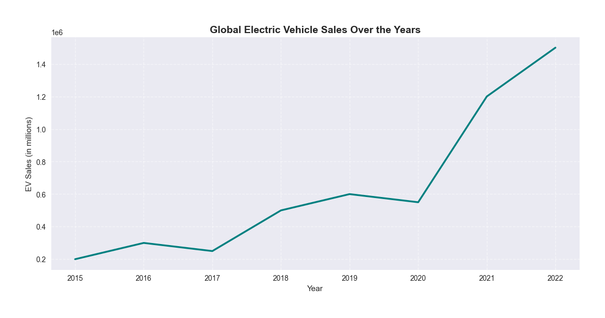
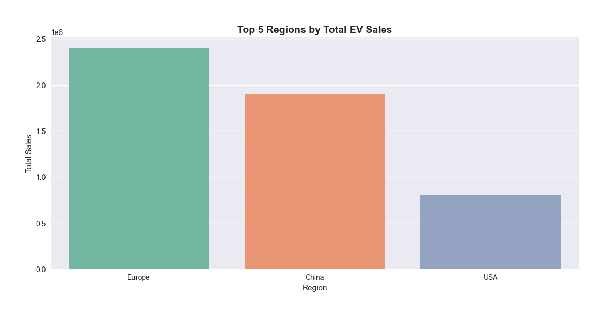
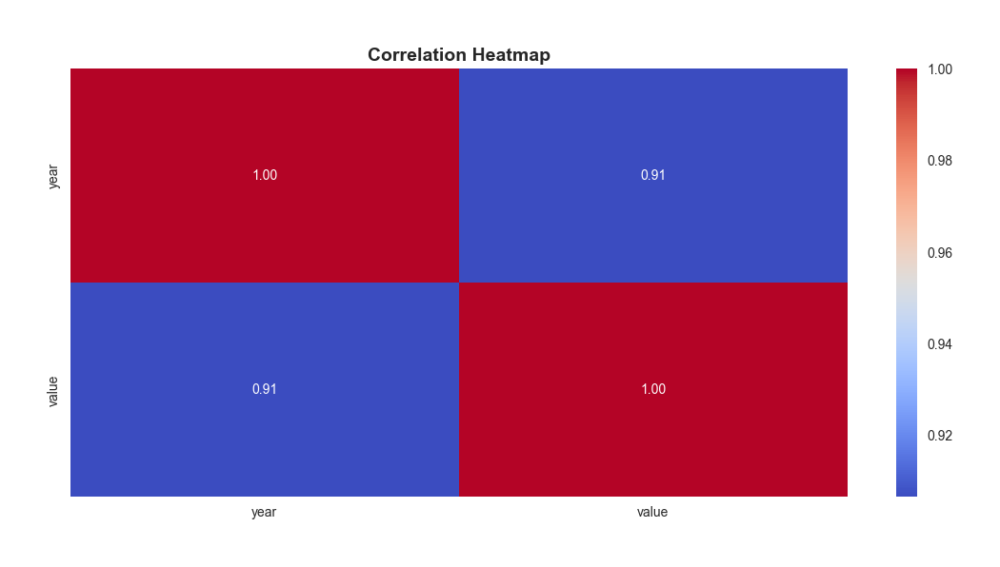

# 🚗 Electric Vehicle (EV) Sales Prediction

### 📘 Overview
This project is developed as part of the **AICTE – EduNet Internship (Electric Vehicle Theme)**.  
It focuses on **analyzing and predicting global Electric Vehicle (EV) sales trends** through data-driven insights and visualization using Python.

---

### 🧩 Problem Statement
With the rapid shift towards sustainable transportation, Electric Vehicles (EVs) have become a key driver of the global clean energy transition.  
However, understanding **how EV adoption varies across regions and years** remains a crucial challenge for policymakers and manufacturers.  

This project aims to:
- Analyze global EV sales patterns over time.  
- Identify **top-performing regions** and **growth trends**.  
- Lay the foundation for **predictive modeling** of future EV sales using machine learning.

---

### 📊 Project Highlights
- **Dataset:** EV sales data from multiple countries (2010–2023)  
- **Tech Stack:** Python, Pandas, Matplotlib, Seaborn  
- **Notebook:** `week1_ev_sales_prediction.ipynb`  
- **Visualizations:**
  - Global EV Sales Trend  
  - Top 5 Regions by EV Sales  
  - Correlation Heatmap  

---

### 🧹 Data Cleaning
Steps performed before analysis:
1. Filtered only EV sales-related data (`parameter == "EV sales"`)  
2. Selected relevant columns: `region`, `year`, and `value`  
3. Converted columns to numeric types and removed missing data  
4. Verified the cleaned dataset shape → `(1342, 3)`

---

### 📈 Exploratory Data Analysis (EDA)
#### 1️⃣ Global EV Sales Over the Years

#### 2️⃣ Top 5 Regions by Total EV Sales

#### 3️⃣ Correlation Heatmap

---

### 🧠 Key Insights
- EV sales have shown **steady growth after 2015**, accelerating sharply post-2020.  
- **China, Europe, and the USA** lead the global EV adoption race.  
- Strong correlation between **year** and **sales** highlights consistent market expansion.

---

### 💻 Tools & Libraries Used
- **Python 3.x**
- **Pandas** – Data cleaning and transformation  
- **Matplotlib & Seaborn** – Visualization and trend analysis  
- **Jupyter Notebook** – Interactive data exploration  

---

### 🏁 Future Scope
- Build a **machine learning model** to predict EV sales growth.  
- Expand the analysis to include **EV stock share, powertrain types, and emissions data**.  
- Create an **interactive dashboard** for real-time EV sales insights.

---

### 👩‍💻 Author
**Shreya V**  
B.E. Computer Science and Engineering (Cybersecurity)  
Sri Krishna College of Technology, Coimbatore  
🔗 [GitHub Profile](https://github.com/Shreyavenkatakumar)

---

⭐ *If you like this project, don’t forget to star the repository and follow for more updates!*
